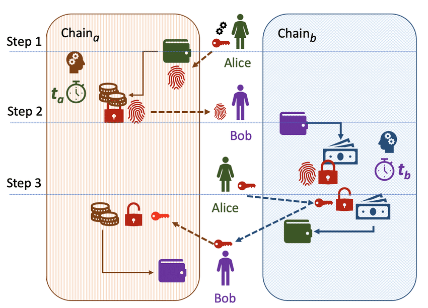

# Nuclearswap (for aeternity hack)

Allow to crosschain exchange tokens like USDT, USDC and other using HTLC contracts()

Approximately it looks like:



more information about HTLC you can read

- https://www.researchgate.net/figure/Hash-time-lock-contract-HTLC_fig1_346143775
- https://docs.lightning.engineering/the-lightning-network/multihop-payments/hash-time-lock-contract-htlc

# setup things
```
cd aeproject
npm install
aeproject env
aecli account create local.wallet
```

# deploy aeternity contracts

```
cd aeproject
make deploy
```

# run aeternity contract tests

```
cd aeproject
make test
```

# start react app

```
cd src
npm start
```

# Flow to deploy contracts and link them

1. Deploy ae
```
cd aeproject
make deploy_uat
make copy
```

2. Set ae owner. Copy ae gate contract to params for set_owner (aeproject/Makefile). Change ct_ to ak_
```
make set_owner_uat
```

3. Copy ae token address to truffle (truffle/migrations/2_deploy_gate.js)

4. Deploy truffle
```
cd truffle
make deploy_goerli
make copy
```

5. Copy eth token address to ae (aeproject/Makefile) and run
```
cd aeproject
make add_bridge
```
